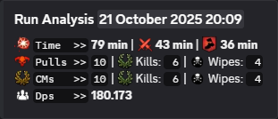
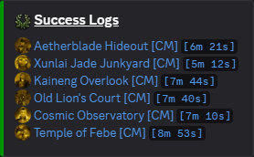
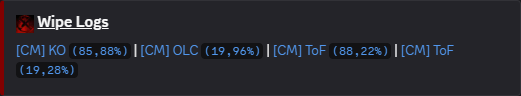
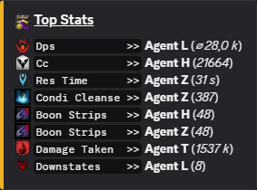
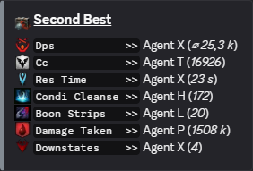
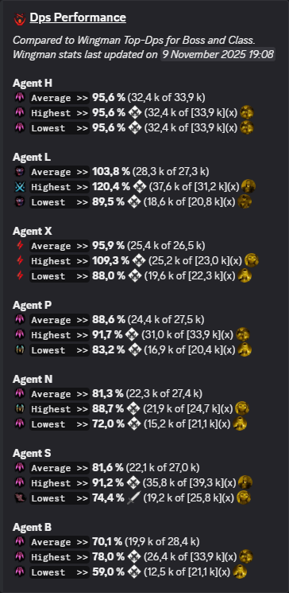

# [InQ] I.S.A.C.
Inquest Strategic Analysis Cube — a discreet Guild Wars 2 assistant part of the [Improvetimized Strategy](https://www.inquestur.com/) Krewe that inhales ArcDPS logs and exhales clean, compact insights right into your Discord. No noise, minimal ceremony, maximum signal. The Krewe observes. The Krewe learns.

## What I.S.A.C. does
- Sketches your squad’s tempo at a glance: time, pressure, momentum, entropy.

- Detects highlight moments and “learning opportunities”.

- Bench-checks each profession against Wingman’s benchmarks—because the lab loves a control group.

- Tracks progress across attempts and sessions—evidence for the “we are improving” hypothesis.

Quietly useful. Curiously insightful. Very Inquest.

## Let the Krewe spy on you
- [Invite link](https://discord.com/oauth2/authorize?client_id=1338186403212693525)

Tip: ensure the bot can Send Messages, Embed Links, and Use External Emojis in the channels you’ll use.

## Commands and controls
- Submit evidence to the archive: /analyze
    - Purpose: Turn one or more ArcDPS logs into a clean squad summary with smart highlights.
    - Arguments:
        - logs: One or more full https (a./b.)dps.report links. Paste them separated by spaces or line breaks; stray text is ignored.
        - Additional options: Shown in the slash UI; defaults are safe.
    - What happens:
        - ISAC fetches the Elite Insights JSON for each link (in parallel when you provide multiple).
        - It compiles a compact summary embed, including:
            - Time, pressure, momentum, and consistency signals.
            - Profession-vs-Wingman benchmark snapshots.
            - Boon uptime and related support indicators (when available).
        - It adds interactive buttons under the result:
            - Time Evolution — the encounter’s heartbeat: pulls, uptime flow, decay.
            - Group DPS Evolution — the squad’s damage arc.
            - DPS Evolution — individual trajectories: who surged, stabilized, or faded.
            - Info — version, last deployment, and quick links.
- /configuration
    - Purpose: Tame ISAC’s defaults for a specific channel—so every summary shows up dressed the way you like.
    - Subcommands:
        - view: Show the current defaults for this channel.
        - update: Set or tweak the defaults used when running /analyze here.
            - Options:
                - name: Title used for analysis messages in this channel.
                - heal: Include heal stats in the analysis output (true/false) only makes sense when your healers run ArcDps healing addon.
                - wingman: Compare professions to Wingman’s benchmarks (true/false).
                - boons: Include boon uptime analysis (true/false).
    - Behavior:
        - Settings are saved per-channel and persist for future runs.
        - /analyze will use these defaults unless you override them in the command UI.

## License
MIT

— From the quiet corners of the Krewe: observe, adapt, improve.